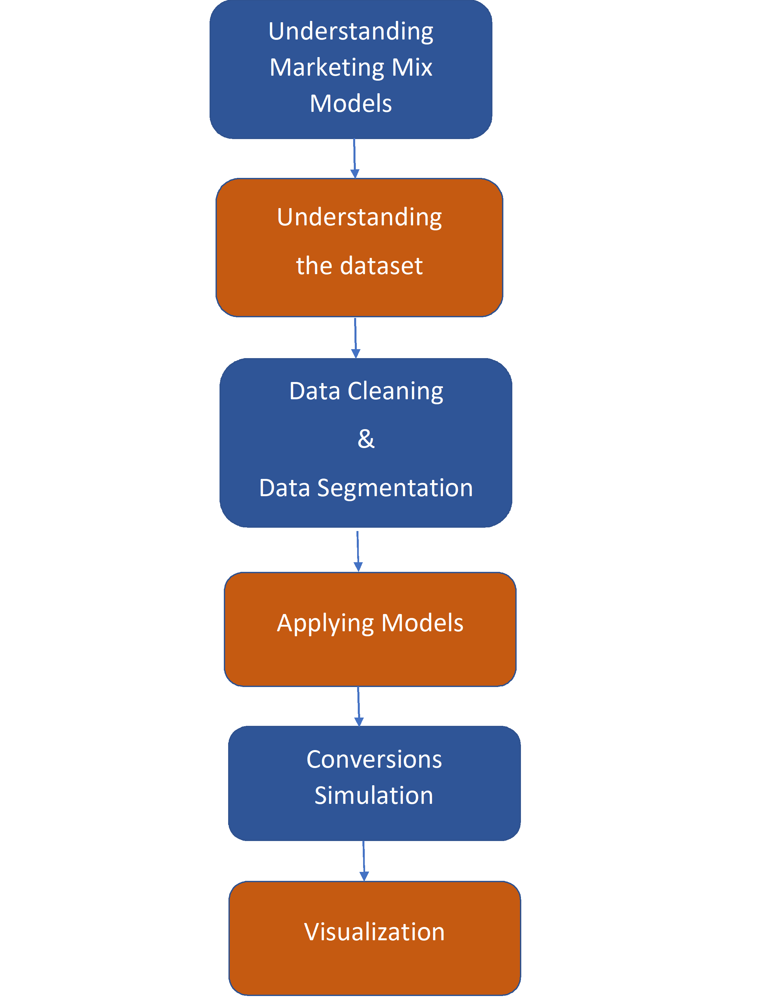

# Marketa Analytica - Understanding the Promotion Campaign.

The focus of this assignment is to understand the effect of different Ad campaigns on TV sales. The data used for the analysis consists of different campaigns and the changes in sales over a period of 260 weeks. The Ad consists of campaigns in different channels like TV and Radio and their impact on the TV sales is studied.

The Dataset and the flow of analysis is attached in the Assignment 3 folder.

First, to work on the visualisation. We moved this data to the Salesforce CRM by creating the object. From the Einstein Analytics, we accessed the CRM data and worked on understanding the adstock effects and TV/Radio Spends across TV and Radio sales.

Procedure to setup the data in salesforce and the insignts of the analysis can be found in the link: https://docs.google.com/document/d/1XosP5DyRejNYaNvh6J4ZvUvWjXQd46t9Tq0OIGPLCJc/edit#

# Assignment 3 - Part 2

The main idea of this assignment is to work with the criteo dataset, and understand the attribution modeling used to help marketers understand the journey of the user.

The blog used as a reference is https://blog.griddynamics.com/cross-channel-marketing-spend-optimization-deep-learning/

On this blog, they have already created Last touch attribution and logistic regression models to give us a little understanding on how the attribution model works.

The following four model is what we have implemented.

First Touch Attribution

Time decay Attribution

U Shaped Attribution

Linear Attribution

To understand this four models with example we looked to this link which gives the understanding of each model in a detailed way https://docs.attributionapp.com/docs/last-touch-attribution-example-direct-included

Budget Optimization

Once after we created this four models, we compared and worked on optimising the budget for the right campaign based on the ROI

Data visualisation
The visualisation tool that we used is VOILA, to get a more understanding about the tool. Here is the link and also steps to install this tool https://blog.jupyter.org/and-voil%C3%A0-f6a2c08a4a93

